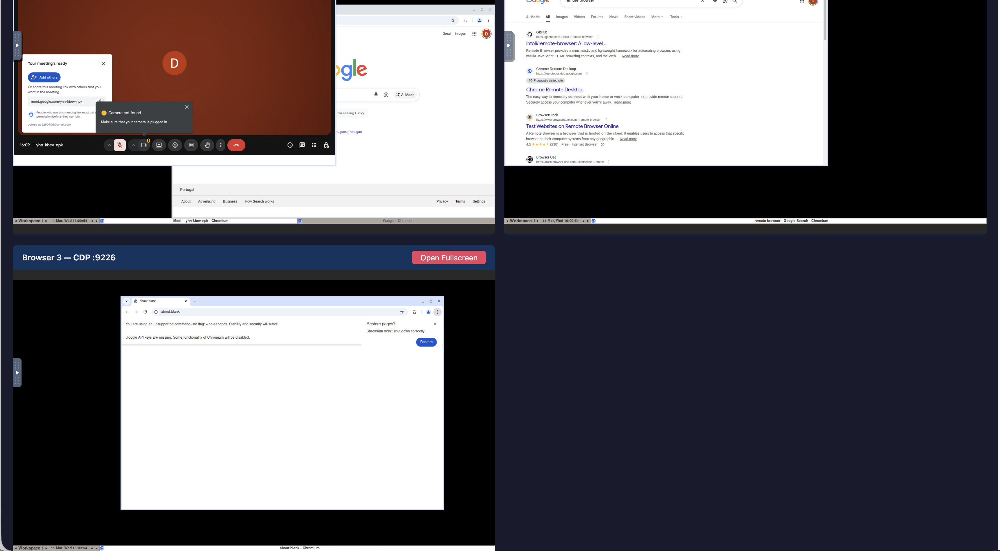

# playwright-vnc

Run headed Playwright browsers in Docker. Watch and control them from anywhere via noVNC in your browser. Agents automate via CDP while humans observe and intervene when needed.



## Why

AI agents that browse the web need headed browsers — for sites that detect headless mode, for Google login, for CAPTCHAs. But running headed browsers on remote servers means you can't see what they're doing.

This project solves that: each browser runs in a Docker container with a virtual display, and noVNC streams it to your browser. You get full visual + keyboard/mouse control. Agents connect via Chrome DevTools Protocol (CDP) and automate programmatically. When the agent hits a login wall or CAPTCHA, you step in via noVNC, handle it, and the agent continues.

## Architecture

```
Your Machine                          Remote Server
┌──────────────────────┐     ┌──────────────────────────────────┐
│                      │     │  Docker Container                │
│  noVNC in browser    │◄──► │    Xvfb (virtual display)        │
│  (watch & interact)  │     │    Fluxbox (window manager)      │
│                      │     │    x11vnc → websockify → noVNC   │
│                      │     │    Chromium (headed)              │
│                      │     │      └─ CDP on :9222             │
└──────────────────────┘     └──────────┬───────────────────────┘
                                        │
                              ┌─────────┴────────────────────────┐
                              │  Agent (on host)                  │
                              │    chromium.connectOverCDP(:9222)  │
                              └───────────────────────────────────┘
```

## Quick Start

### Single browser

```bash
git clone https://github.com/DmitriyG228/playwright-vnc.git
cd playwright-vnc
docker compose up -d --build
```

Open `http://localhost:6080/vnc.html` → click Connect. You're looking at the remote browser.

### Agent connects to the browser

```bash
npm install playwright@1.50.0
node agent-example.js
```

```js
const { chromium } = require('playwright');
const browser = await chromium.connectOverCDP('http://localhost:9222');
const page = browser.contexts()[0].pages()[0];
await page.goto('https://example.com');
```

### Multi-browser (3 agents)

The default `docker-compose.yml` starts 3 browsers:

| Browser | noVNC | CDP Port |
|---------|-------|----------|
| 1 | `:6080` | `localhost:9222` |
| 2 | `:6081` | `localhost:9224` |
| 3 | `:6082` | `localhost:9226` |

Open `http://localhost:6080/vnc.html` (or `/index.html` for the dashboard showing all 3).

## Human-in-the-Loop

When the agent hits something requiring human input (login, 2FA, CAPTCHA):

```js
await page.goto('https://accounts.google.com');
console.log('Please sign in via noVNC...');
await page.waitForURL('**/myaccount.google.com/**', { timeout: 300000 });
console.log('Logged in! Continuing automation...');
```

The agent waits. You type credentials in the noVNC window. Agent continues after detecting the redirect.

## Cookie Sharing Between Browsers

Log into Google once in browser-1, then sync to all others:

```bash
node share-cookies.js sync
```

Or selectively:
```bash
node share-cookies.js export 9222    # export from browser-1
node share-cookies.js import 9224    # import into browser-2
node share-cookies.js import 9226    # import into browser-3
```

## Remote Access

For accessing browsers on a remote server securely:

### Option A: SSH Tunnel (quickest)
```bash
ssh -L 6080:localhost:6080 -L 9222:localhost:9222 user@server
# Open http://localhost:6080/vnc.html locally
```

### Option B: Tailscale (recommended for ongoing use)
```bash
# On server
curl -fsSL https://tailscale.com/install.sh | sh
sudo tailscale up

# On your machine
tailscale up  # sign in with same account

# Access via Tailscale IP
# http://100.x.x.x:6080/vnc.html
```

### Option C: Nginx reverse proxy with auth
```nginx
server {
    listen 443 ssl;
    server_name browser.yourdomain.com;

    ssl_certificate     /path/to/cert.pem;
    ssl_certificate_key /path/to/key.pem;

    auth_basic "Remote Browser";
    auth_basic_user_file /etc/nginx/.htpasswd;

    # Dashboard
    location = / {
        alias /path/to/playwright-vnc/;
        try_files /index.html =404;
    }

    # Browser 1
    location /1/ {
        proxy_pass http://localhost:6080/;
        proxy_http_version 1.1;
        proxy_set_header Upgrade $http_upgrade;
        proxy_set_header Connection "upgrade";
    }

    # Browser 2
    location /2/ {
        proxy_pass http://localhost:6081/;
        proxy_http_version 1.1;
        proxy_set_header Upgrade $http_upgrade;
        proxy_set_header Connection "upgrade";
    }

    # Browser 3
    location /3/ {
        proxy_pass http://localhost:6082/;
        proxy_http_version 1.1;
        proxy_set_header Upgrade $http_upgrade;
        proxy_set_header Connection "upgrade";
    }
}
```

Create htpasswd: `sudo htpasswd -c /etc/nginx/.htpasswd myuser`

Access: `https://browser.yourdomain.com/1/vnc.html?path=1/websockify&autoconnect=true&resize=scale`

## Configuration

### Single browser

Replace `docker-compose.yml` with:

```yaml
services:
  browser:
    build: .
    ports:
      - "6080:6080"
      - "9222:9223"
    shm_size: 2g
    volumes:
      - userdata:/app/userdata
    restart: unless-stopped

volumes:
  userdata:
```

### Scaling beyond 3

Add more services to `docker-compose.yml`. Each browser needs unique host ports:

```yaml
  browser-4:
    build: .
    ports:
      - "6083:6080"   # noVNC
      - "9228:9223"   # CDP
    shm_size: 2g
    volumes:
      - agent4-data:/app/userdata
    restart: unless-stopped
```

Each browser uses ~1-2 GB RAM.

### VNC password

By default, no VNC password is set (rely on network-level auth). To add one, edit `start.sh`:

```bash
# Replace:
x11vnc -display :99 -forever -nopw -shared -rfbport 5900 &
# With:
x11vnc -display :99 -forever -passwd YOUR_PASSWORD -shared -rfbport 5900 &
```

### Screen resolution

Edit `start.sh`:
```bash
Xvfb :99 -screen 0 1920x1080x24 &  # change resolution here
```

## Operations

```bash
docker compose up -d          # start
docker compose down           # stop
docker compose restart        # restart (keeps cookies)
docker compose logs -f        # view logs

# Fresh start (wipe all cookies/sessions)
docker compose down
docker volume rm $(docker volume ls -q | grep playwright-vnc)
docker compose up -d
```

## How It Works

1. **Xvfb** creates a virtual framebuffer (fake display `:99`)
2. **Fluxbox** provides a minimal window manager
3. **Chromium** launches headed into the virtual display with CDP enabled
4. **x11vnc** captures the display and serves it over VNC protocol
5. **websockify + noVNC** bridges VNC to WebSocket so you can view it in any browser
6. **socat** proxies the CDP port to `0.0.0.0` so it's accessible from outside the container

Key flags:
- `ignoreDefaultArgs: ['--enable-automation']` — hides the "controlled by automated software" banner so Google login works
- `--disable-blink-features=AutomationControlled` — prevents `navigator.webdriver` detection
- `launchPersistentContext()` — cookies and sessions persist in a Docker volume

## Troubleshooting

### Google says "Couldn't sign you in — this browser may not be secure"
The `--enable-automation` flag is still present. Make sure `ignoreDefaultArgs` is set in `start.sh`.

### "The profile appears to be in use by another Chromium process"
Stale lock file. Restart the container — `start.sh` cleans locks on startup.

### Black screen in noVNC
The Chromium window may be minimized or off-screen. Either:
- Right-click in noVNC to get the Fluxbox menu
- Or send a navigation command via CDP to bring the window back

### CDP connection refused
Browser may still be starting. Wait a few seconds. Check: `curl http://localhost:9222/json/version`

### Clipboard doesn't work
noVNC limitation. Use the clipboard panel (icon on the left sidebar of noVNC) to copy/paste between local and remote.

## File Structure

```
playwright-vnc/
├── Dockerfile           # Playwright + Xvfb + noVNC + socat
├── start.sh             # Entrypoint: starts all services + browser
├── docker-compose.yml   # Multi-browser setup (3 browsers)
├── index.html           # Dashboard showing all browsers
├── agent-example.js     # Example: agent connects and controls browser
├── share-cookies.js     # Export/import cookies between browsers
├── .gitignore
├── LICENSE
└── README.md
```

## Security

- **No public ports by default.** Use SSH tunnel, Tailscale, or authenticated reverse proxy for remote access.
- **No VNC password by default.** Network-level auth (SSH/Tailscale/nginx basicauth) is the primary security layer. Add a VNC password for defense-in-depth.
- **Cookies on disk.** Stored in Docker volumes. Only root can access. For extra security, encrypt backups with `gpg`.
- **CDP port.** Never expose `:9222` to the public internet without authentication.
- **Automation flags hidden.** `--enable-automation` removed and `navigator.webdriver` disabled so sites don't block the browser.

## License

MIT
